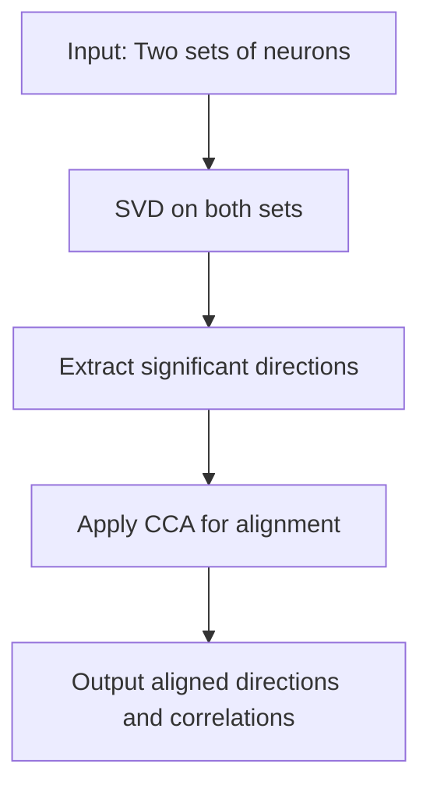

- **SVCCA Overview**: Singular Vector Canonical Correlation Analysis (SVCCA) combines Singular Value Decomposition (SVD) and Canonical Correlation Analysis (CCA) to analyze deep learning representations.
  
- **Key Contributions**:
  - **Dimensionality vs. Neurons**: The dimensionality of a layer's representation is often less than the number of neurons; SVCCA can identify critical directions for performance (Section 2.1).
  - **Learning Dynamics**: Networks converge to representations from the bottom up, suggesting a method called Freeze Training to improve efficiency (Sections 4.1, 4.2).
  - **Speed Optimization**: A method based on the discrete Fourier transform accelerates SVCCA application to convolutional networks (Section 3).
  - **Class Sensitivity**: SVCCA captures class-specific information, revealing when architectures become sensitive to different classes (Section 4.3).

- **SVCCA Methodology**:
  - **Input**: Two sets of neuron outputs (layers) \( l_1 \) and \( l_2 \).
  - **Step 1**: Perform SVD on both layers to extract significant directions, retaining those that explain 99% of variance.
  - **Step 2**: Apply CCA to align the subspaces and compute correlation coefficients \( \rho_i \) for the aligned directions.
  - **Output**: Aligned direction pairs and their correlation values.

- **Representation Definition**:
  - A neuron's representation is defined as its output vector over a dataset \( X = \{x_1, \ldots, x_m\} \):
    \[
    z^l_i = (z^l_i(x_1), \ldots, z^l_i(x_m))
    \]
  - A layer's representation is the subspace spanned by its neurons' vectors.

- **Distributed Representations**: SVCCA identifies that important directions are often distributed across multiple neurons rather than being axis-aligned.

- **Experimental Setup**: Experiments primarily conducted on CIFAR-10 using convolutional and residual networks, with additional toy regression tasks for illustration.

- **Performance Insights**:
  - Few SVCCA directions can achieve high accuracy, indicating effective summarization of information.
  - Comparison of SVCCA directions against random and maximum activation neuron selections shows superior performance with fewer directions.

- **Scaling SVCCA**:
  - **Same Layer Comparisons**: Concatenate outputs from the same layer across different timesteps or initializations.
  - **Different Layer Comparisons**: Flatten convolutional outputs to compare across different layers or networks.

- **Algorithmic Flow** (if needed):

- **Model Compression Implications**: Findings suggest potential for model compression by reducing the number of neurons while maintaining performance (Section 4.4).