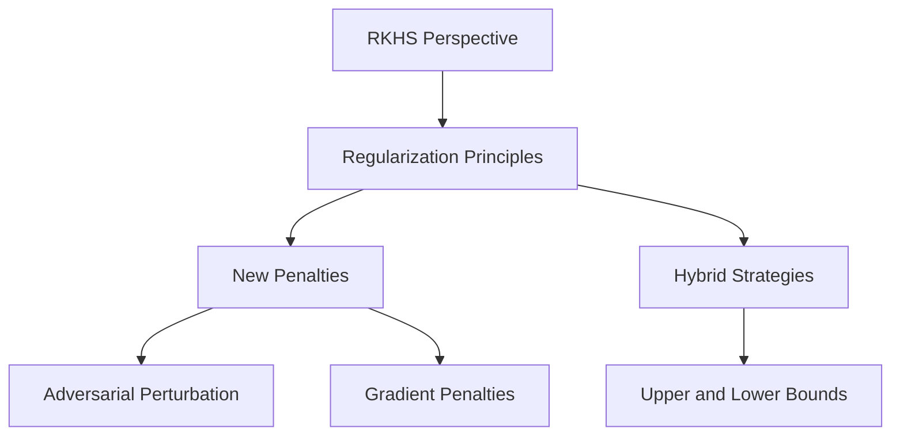

- **RKHS Perspective**: Introduces a new viewpoint for regularizing deep neural networks using the norm of a Reproducing Kernel Hilbert Space (RKHS).
  
- **Key Contributions**:
  - Unifies various regularization principles (e.g., spectral norm, gradient penalties, adversarial training).
  - Proposes new effective regularization penalties based on RKHS norm approximations.
  - Suggests hybrid strategies combining upper and lower bounds for better RKHS norm approximations.

- **RKHS Norm**: 
  - Acts as a natural regularization function controlling model complexity and stability to adversarial perturbations.
  - Cannot be explicitly computed; requires upper and lower approximations.

- **Regularization Strategies**:
  - **Lower Bounds**: Derived from the variational characterization of Hilbert norms.
    - Adversarial perturbation penalty: 
      \[
      f_H \geq f_2^\delta = \sup_{x \in X, \|\delta\|_2 \leq 1} (f(x + \delta) - f(x))
      \]
    - Gradient penalties:
      \[
      f_H \geq \sup_{x,y \in X} \frac{f(x) - f(y)}{\|x - y\|_2} \geq \|\nabla f\|_2
      \]

- **Optimization Problems**:
  - Penalized optimization:
    \[
    \min_\theta \frac{1}{n} \sum_{i=1}^n (y_i, f_\theta(x_i)) + \lambda \|f_\theta\|_H^2
    \]
  - Constrained optimization:
    \[
    \min_\theta \text{ s.t. } \|f_\theta\|_H \leq C \quad \frac{1}{n} \sum_{i=1}^n (y_i, f_\theta(x_i))
    \]

- **Robust Optimization**: 
  - Related to adversarial training:
    \[
    \min_\theta \frac{1}{n} \sum_{i=1}^n \sup_{\|\delta\|_2 \leq 1} (y_i, f_\theta(x_i + \delta))
    \]

- **Connections to Existing Work**: 
  - Links to previous regularization strategies and adversarial robustness approaches.
  - Highlights the relationship between regularization and robustness in the RKHS framework.

- **Empirical Effectiveness**: 
  - Demonstrated effectiveness of proposed methods on small datasets and in adversarial settings.

- **Diagrammatic Note** (if needed):
