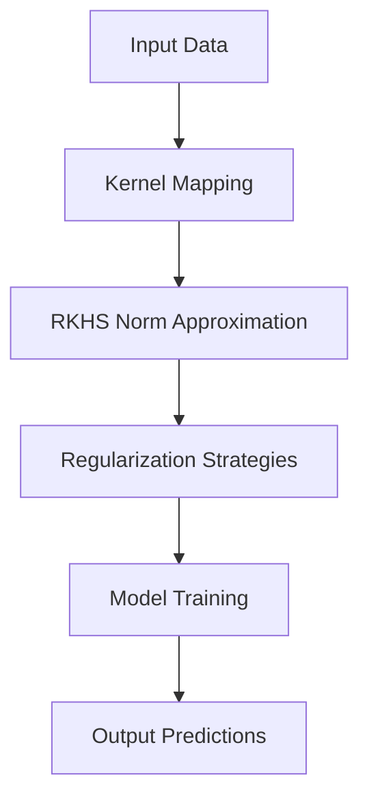

- **RKHS Perspective**: Regularization of deep neural networks through the norm of a Reproducing Kernel Hilbert Space (RKHS) provides a unified framework for various regularization techniques.
  
- **RKHS Norm**: The RKHS norm cannot be computed directly but can be approximated using upper and lower bounds, leading to practical regularization strategies.

- **Key Contributions**:
  - Unified view on existing regularization principles (e.g., spectral norm, gradient penalties, adversarial training).
  - Introduction of new effective regularization penalties based on adversarial perturbations and gradient norms.
  - Hybrid strategies combining upper and lower bounds for better RKHS norm approximations.

- **Regularization Strategies**:
  - **Adversarial Perturbation Penalty**: 
    - Defined as \( f_H \geq f_2^\delta = \sup_{x \in X, \| \delta \|_2 \leq 1} (f(x + \delta) - f(x)) \).
    - Useful for robust model training, decoupled from the loss term.
  
  - **Gradient Penalties**:
    - Lower bound based on Lipschitz continuity: \( f_H \geq \sup_{x,y \in X} \frac{f(x) - f(y)}{\|x - y\|_2} \).
    - Related to stabilizing training in generative adversarial networks.

- **Optimization Problems**:
  - Penalized optimization: 
    \[
    \min_\theta \left( \frac{1}{n} \sum_{i=1}^n (y_i, f_\theta(x_i)) + \lambda \|f_\theta\|_H^2 \right)
    \]
  - Constrained optimization:
    \[
    \min_\theta \text{ subject to } \|f_\theta\|_H \leq C \quad \frac{1}{n} \sum_{i=1}^n (y_i, f_\theta(x_i))
    \]

- **Robust Optimization**:
  - Related to adversarial training objectives:
    \[
    \min_\theta \frac{1}{n} \sum_{i=1}^n \sup_{\|\delta\|_2 \leq 1} (y_i, f_\theta(x_i + \delta))
    \]

- **Connections to Existing Work**: 
  - Links to previous regularization strategies and adversarial robustness, including works by Cisse et al. (2017), Madry et al. (2018), and others.

- **Theoretical Insights**: 
  - The RKHS norm acts as a Lipschitz constant, providing control over model stability against adversarial perturbations.

- **Empirical Effectiveness**: 
  - The proposed methods show improved performance in scenarios with small datasets and adversarial conditions.

- **Diagrammatic Note** (if needed):
