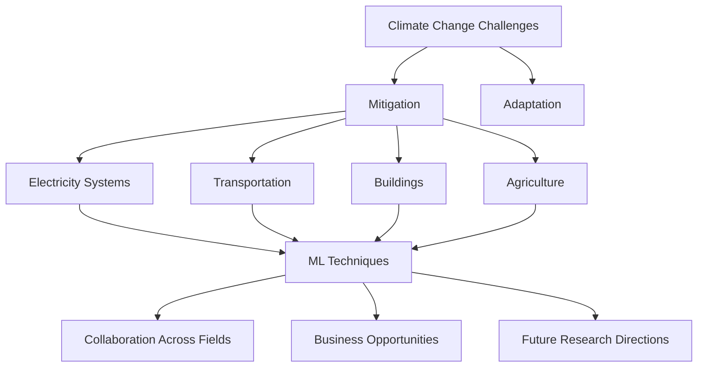

- **Climate Change Overview**: Climate change leads to severe weather events and ecosystem changes, necessitating urgent action to mitigate greenhouse gas (GHG) emissions and adapt to impacts.
  
- **Mitigation vs. Adaptation**: Mitigation focuses on reducing emissions across sectors (electricity, transportation, buildings, industry, land use), while adaptation involves preparing for climate impacts through resilience planning and disaster management.

- **Machine Learning (ML) Applications**: ML can address high-impact problems in climate change through innovative research and effective engineering, including:
  - **Electricity Systems**: Transitioning to low-carbon sources, optimizing existing systems, and improving forecasting.
  - **Transportation**: Enhancing vehicle efficiency and promoting alternative fuels.
  - **Buildings**: Optimizing energy consumption and urban planning.
  - **Agriculture**: Precision agriculture and remote sensing for emissions monitoring.

- **Key ML Techniques**:
  - **Forecasting**: Utilizing historical data and physical models to predict electricity supply and demand, improving accuracy and uncertainty quantification.
  - **Optimization**: Applying ML to solve NP-hard scheduling problems in electricity systems, enhancing efficiency in real-time operations.

- **High-Leverage Opportunities**:
  - **Forecasting Supply and Demand**: ML can improve short- and long-term forecasts, aiding in the management of variable energy sources and reducing reliance on fossil fuel standby plants.
  - **Dynamic Scheduling**: Implementing ML for real-time grid balancing and optimizing power system operations.

- **Collaboration Across Fields**: Successful ML applications in climate change require interdisciplinary collaboration with experts in operations research, electrical engineering, and climate science.

- **Business and Policy Implications**: Identifying opportunities for startups and nonprofits in ML applications for climate solutions, and encouraging governments to leverage ML for public service improvements and data-driven decision-making.

- **Future Research Directions**: Exploring interpretable ML in climate models, enhancing the integration of domain-specific insights into ML algorithms, and developing tools for assessing the societal impacts of climate change.

- **Diagrammatic Note** (if needed):
