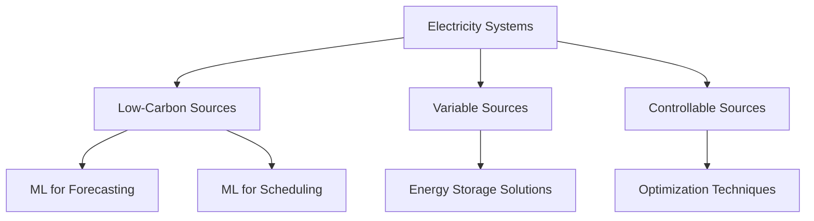

- **Climate Change Overview**
  - Major challenges: storms, droughts, fires, flooding.
  - Urgent need to eliminate global greenhouse gas (GHG) emissions within 30 years.

- **Machine Learning (ML) Applications**
  - ML can aid in both mitigation (reducing emissions) and adaptation (preparing for impacts).
  - High-impact areas for ML: electricity systems, transportation, buildings, industry, land use.

- **Electricity Systems**
  - Responsible for ~25% of human-caused GHG emissions.
  - Transition to low-carbon sources (solar, wind, hydro, nuclear) is essential.
  - ML can improve forecasting, scheduling, and management of electricity systems.

- **Forecasting Supply and Demand**
  - Accurate forecasting is critical for managing variable generation and demand.
  - ML methods used: supervised learning, fuzzy logic, hybrid models.
  - Incorporate domain-specific insights (e.g., weather data) for improved accuracy.

- **Scheduling and Dispatch**
  - NP-hard optimization problems govern scheduling in electricity systems.
  - ML can enhance optimization processes and improve solution quality.
  - Techniques: neural networks, genetic algorithms, reinforcement learning.

- **Materials Science**
  - ML accelerates discovery of new materials for energy storage and solar fuels.
  - Combines heuristics with experimental data and physics for material property predictions.
  - Applications include battery technology improvements.

- **Key Recommendations for Stakeholders**
  - **Researchers/Engineers**: Focus on conceptual innovation in ML for climate applications.
  - **Entrepreneurs/Investors**: Identify deployment opportunities for existing ML techniques.
  - **Corporate Leaders**: Optimize supply chains and adopt precision agriculture tools.
  - **Governments**: Use ML for public service improvements and data-driven decision-making.

- **ML Techniques Relevant to Climate Solutions**
  - Causal inference, computer vision, interpretable models, reinforcement learning, time-series analysis, transfer learning, uncertainty quantification, unsupervised learning.

- **Diagram: ML Contributions to Electricity Systems**

- **Future Directions**
  - Need for interdisciplinary collaboration between ML and other fields (e.g., operations research, social sciences).
  - Emphasis on deploying ML solutions at scale to achieve significant climate impact.