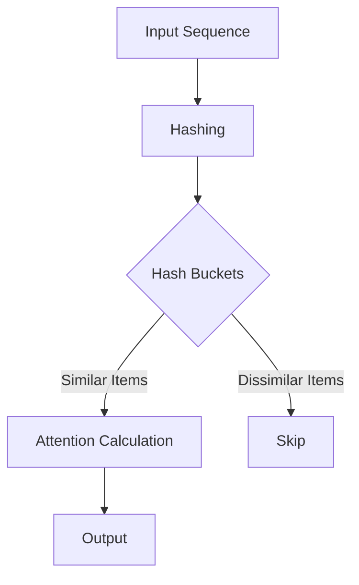

- **Reformer Overview**: Introduces techniques to improve Transformer efficiency, focusing on locality-sensitive hashing (LSH) and reversible residual layers.
  
- **Complexity Reduction**: 
  - Traditional attention complexity: \(O(L^2)\)
  - LSH attention complexity: \(O(L \log L)\)

- **Memory Efficiency**: 
  - Reversible layers allow storing activations once instead of \(N\) times (where \(N\) is the number of layers).
  - Memory use in a model with \(N\) layers is \(N\) times larger due to back-propagation requirements.

- **Attention Mechanism**:
  - Standard attention: 
    \[
    Attention(Q, K, V) = softmax\left(\frac{QK^T}{\sqrt{d_k}}\right)V
    \]
  - LSH attention focuses on nearest neighbors, reducing the number of keys considered for each query.

- **Locality-Sensitive Hashing (LSH)**:
  - Assigns similar vectors to the same hash bucket with high probability.
  - Uses random projections to create hash functions.

- **Hashing Attention Equation**:
  - For a single query \(i\):
    \[
    o_i = \sum_{j \in P_i} \exp(q_i \cdot k_j - z(i, P_i)) v_j
    \]
  - \(P_i\) is the set of keys attended to by query \(i\).

- **Multi-Round LSH Attention**:
  - Reduces the probability of similar items falling into different buckets by using multiple hash functions:
    \[
    P_i = \bigcup_{r=1}^{n \text{ rounds}} P^{(r)}_i
    \]

- **Causal Masking**: 
  - Prevents future positions from being attended to in the decoder, modified to avoid self-attention in shared-QK formulation.

- **Experimental Validation**:
  - Tested on synthetic tasks and real-world tasks (e.g., enwik8, imagenet-64).
  - Reformer matches full Transformer performance while being faster and more memory-efficient.

- **Key Results**:
  - Reformer achieves comparable results to full attention models with significantly reduced memory usage and training time.

- **Diagrammatic Representation** (if needed):
