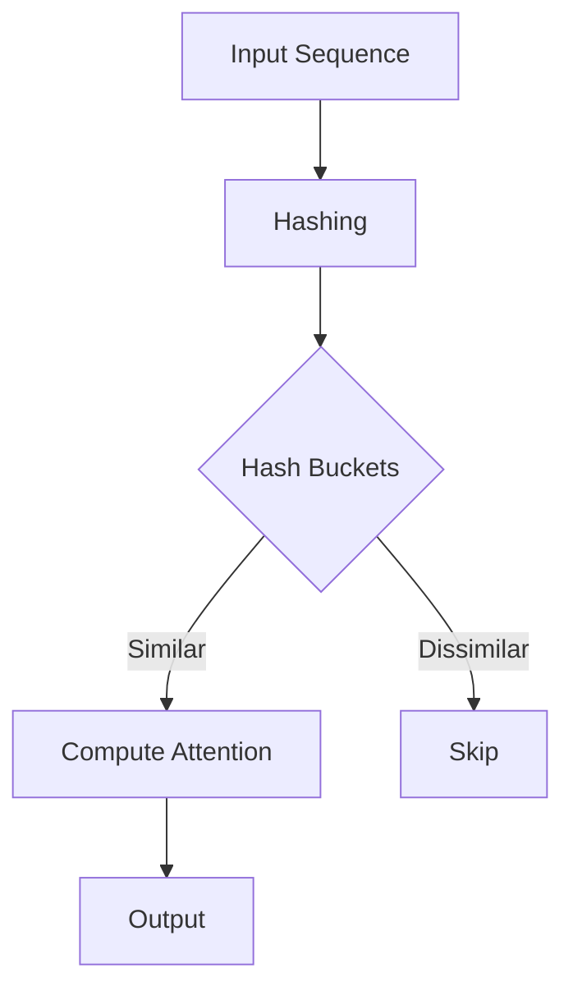

- **Reformer Overview**: Introduces two key techniques to improve Transformer efficiency: locality-sensitive hashing (LSH) for attention and reversible residual layers.
  
- **Complexity Reduction**: 
  - Standard attention complexity: \(O(L^2)\) 
  - LSH attention complexity: \(O(L \log L)\) 
  - Memory savings from reversible layers: Activations stored once instead of \(N\) times (where \(N\) is the number of layers).

- **Memory Usage Calculation**: 
  - Memory for parameters: \(0.5B\) parameters = \(2GB\) 
  - Memory for activations (64K tokens, embedding size 1024, batch size 8): \(64K \times 1K \times 8 = 0.5B\) floats = \(2GB\).

- **Memory Bottlenecks**: 
  - Activations must be stored for back-propagation, leading to \(N\)-fold memory increase.
  - Feed-forward layer depth \(d_{ff}\) often exceeds attention layer depth \(d_{model}\), increasing memory usage.

- **Reversible Layers**: 
  - Allow storing only a single copy of activations, eliminating the \(N\) factor in memory usage.

- **Locality-Sensitive Hashing (LSH)**: 
  - Efficiently finds nearest neighbors in high-dimensional spaces.
  - Hashing scheme ensures nearby vectors share the same hash with high probability.

- **Attention Mechanism**: 
  - Standard attention: 
    \[
    Attention(Q, K, V) = softmax\left(\frac{QK^T}{\sqrt{d_k}}\right)V
    \]
  - LSH attention focuses on a subset of keys based on hash buckets, reducing computation.

- **Multi-Round LSH Attention**: 
  - Reduces the probability of similar items falling into different buckets by using multiple hash functions:
    \[
    P_i = \bigcup_{r=1}^{n \text{ rounds}} P^{(r)}_i
    \]

- **Causal Masking in LSH**: 
  - Prevents future token attention in decoder models, modified to avoid self-attention in shared-QK setups.

- **Experimental Results**: 
  - Reformer matches full Transformer performance on tasks like enwik8 and imagenet-64 while being faster and more memory-efficient.

- **Key Equations**:
  - LSH attention for a single query:
    \[
    o_i = \sum_{j \in P_i} \exp(q_i \cdot k_j - z(i, P_i)) v_j
    \]
  - Set of keys for query \(i\):
    \[
    P_i = \{j : h(q_i) = h(k_j)\}
    \]

- **Diagrammatic Representation** (if needed):

- **Conclusion**: Reformer provides a scalable alternative to traditional Transformers, enabling efficient training on long sequences with reduced memory requirements.