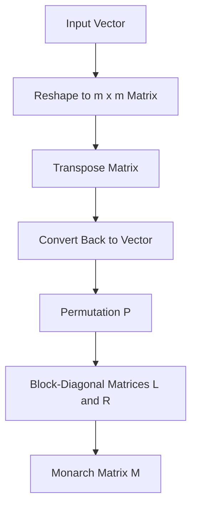

- **Monarch Matrix Definition**: A Monarch matrix \( M \) is defined as \( M = PLPR \), where \( L \) and \( R \) are block-diagonal matrices, \( P \) is a permutation matrix, and \( n = m^2 \) (Definition 3.1).

- **Parameterization**: Monarch matrices are parameterized as products of two block-diagonal matrices, enhancing hardware efficiency on GPUs and allowing for optimized batch-matrix-multiply routines (Section 5.1.1).

- **Expressiveness**: Monarch matrices can represent various fast transforms (e.g., Fourier, convolution) and inherit expressiveness from butterfly matrices, which can represent low-depth arithmetic circuits (Proposition 3.2).

- **Efficiency-Quality Tradeoff**: Monarch matrices achieve favorable accuracy-efficiency tradeoffs, enabling 2× speedup in training ViT and GPT-2 models with comparable accuracy on benchmark tasks (Section 5.1).

- **Reverse Sparsification Technique**: This technique allows for transitioning from sparse to dense weight matrices, facilitating faster training of dense models by using Monarch matrices as an intermediate representation (Section 5.2).

- **Dense-to-Sparse Fine-Tuning**: The Monarch approximation algorithm enables efficient fine-tuning of pretrained models, achieving 1.7× faster BERT fine-tuning on GLUE with similar accuracy (Section 5.3).

- **Analytical Optimal Solution**: The problem of approximating a dense weight matrix with a Monarch matrix has an analytical optimal solution, despite being nonconvex (Theorem 1).

- **Empirical Validation**: Monarch matrices reduce error by up to 40% in PDE solving and MRI reconstruction tasks while maintaining training speed compared to traditional Fourier-based methods.

- **Comparison with Existing Methods**: Unlike pruning methods that focus on inference efficiency, Monarch emphasizes overall efficiency in both training and inference, making it a more holistic approach to model compression.

- **Butterfly Matrices Relation**: Monarch matrices are related to butterfly matrices, which are defined as products of permuted block-diagonal matrices and can represent structured matrices with optimal parameters and runtime (Section 4).

- **Algorithm for Projection**: A derived projection algorithm allows for approximating a given dense matrix with a Monarch matrix, addressing the long-standing projection problem in structured matrices (Section 3.3).

- **Training Speed Improvements**: Monarch matrices enable significant speed improvements in training large models, achieving 2× faster pretraining on OpenWebText compared to optimized implementations from Nvidia.

- **Diagram of Monarch Matrix Structure**:
