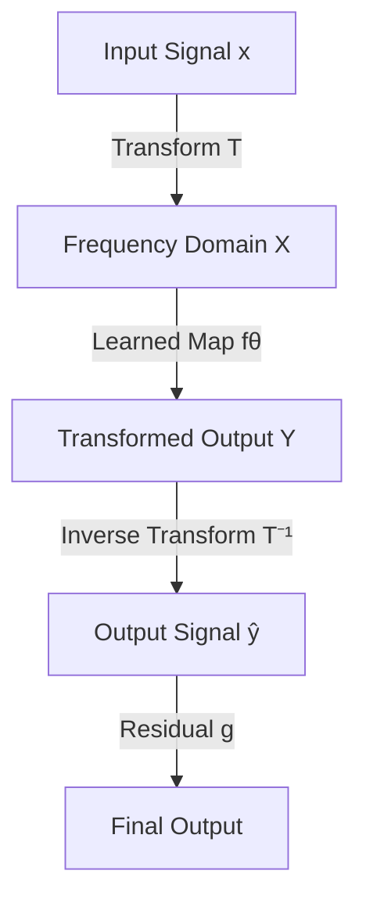

- **Title**: Efficient Operator Learning in Frequency Domain
- **Key Concept**: Frequency-domain models (FDMs) leverage the structure in the frequency domain for efficient learning of long-range correlations in signals.
- **Main Contribution**: Introduction of the "Transform Once" (T1) approach, which reduces computational overhead by requiring only a single transform (T) instead of separate forward and inverse transforms.
- **Computational Efficiency**: T1 achieves speedups of 3x to 10x compared to traditional FDMs, with improvements scaling with data resolution and model size.
- **Weight Initialization**: A variance-preserving weight initialization scheme is derived to enhance learning efficiency in the frequency domain.
- **Learning Objective**: The learning objective is defined as minimizing the approximation error \( J_\theta \) of the output signal spectrum \( Y \) in the k-space:
  \[
  J_\theta = \min_\theta E_{x,y} \| T(y) - \hat{Y} \|^2
  \]
- **Parseval-Plancherel Identity**: The relationship between the signal and its transform is preserved, allowing for effective learning in the frequency domain:
  \[
  \phi(x) = T^{-1} \circ \psi \circ T(x)
  \]
- **Transform Selection**: The normalized Discrete Cosine Transform (DCT-II) is chosen for T1 due to its effective representation of smooth signals and superior energy compaction compared to DFT.
- **Reduced-Order T1 Model**: Operates on a reduced k-space \( D_m \) by selecting \( m < N \) elements, allowing for smaller neural networks and efficient learning:
  \[
  J_\theta = \min_\theta E_{x,y} \| S_m Y - \hat{Y} \|^2
  \]
- **Mode Selection**: Optimal mode selection for reconstruction tasks involves choosing the top \( m \) modes with the highest magnitude to minimize irreducible loss:
  \[
  k_0, \ldots, k_{m-1} = \text{top } m \text{ modes of } |X_k|
  \]
- **Empirical Observations**: Reduced-order T1 models often exhibit lower irreducible error compared to non-reduced-order FDMs, indicating better efficiency in learning tasks.

