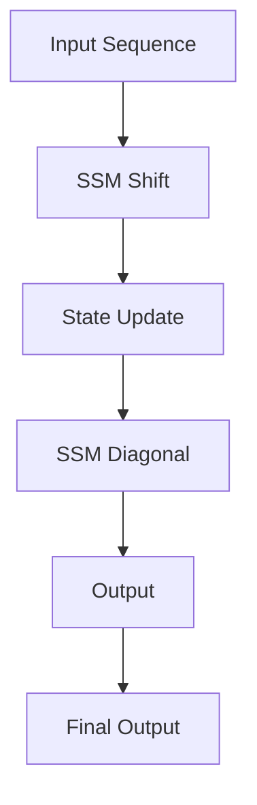

- **State Space Models (SSMs)**: Achieve state-of-the-art performance in various domains but lag behind Transformers in language modeling due to expressivity gaps.
  
- **Expressivity Gap**: Identified through synthetic language tasks; SSMs struggle with recalling earlier tokens and comparing tokens across sequences.

- **H3 Layer (Hungry Hungry Hippo)**: A new SSM layer designed to address the expressivity gap by:
  - Stacking two SSMs with shift and diagonal matrices.
  - Utilizing multiplicative interactions for token comparisons.
  - Achieving near parity with attention on synthetic tasks and within 0.4 PPL of Transformers on OpenWebText.

- **Hybrid H3-Attention Model**: Combines H3 with two attention layers, outperforming Transformers by 1.0 PPL on OpenWebText.

- **FlashConv**: A novel algorithm to enhance SSM efficiency on modern hardware:
  - Utilizes a fused block FFT algorithm for sequences up to 8K.
  - Introduces a state-passing algorithm to process longer sequences efficiently.
  - Achieves 2× speedup on long-range arena benchmarks and 2.4× faster text generation compared to Transformers.

- **Training and Scaling**: 
  - Trained hybrid models (125M, 355M, 1.3B, 2.7B parameters) on the Pile dataset.
  - Demonstrated lower perplexity than Transformers and superior performance in zero-and few-shot learning on SuperGLUE tasks.

- **Key Formulas**:
  - Continuous-time state-space representation: 
    \[
    \dot{x}(t) = Ax(t) + Bu(t), \quad y(t) = Cx(t) + Du(t)
    \]
  - Discrete-time state-space representation:
    \[
    x_i = Ax_{i-1} + Bu_i, \quad y_i = Cx_i + Du_i
    \]
  - Output of SSM:
    \[
    y = SSM(u)
    \]

- **H3 Output Formula**:
  \[
  O_i = Q \cdot SSM_{\text{diag}}(SSM_{\text{shift}}(K) \cdot V)
  \]

- **Performance Metrics**: 
  - Perplexity (PPL) comparisons: H3 within 0.4 PPL of Transformers, hybrid model outperforming by 1.0 PPL.
  - Speed improvements: FlashConv yields 2× speedup and 2.4× faster inference.

- **Synthetic Language Tasks**: 
  - Induction Head Task: Tests recall after a special token.
  - Associative Recall: Requires remembering multiple key-value pairs.

- **Hardware Utilization**: 
  - SSMs scale nearly linearly in sequence length, but require optimization for efficient GPU utilization.
  - FlashConv addresses memory read/write inefficiencies and leverages specialized matrix multiply units.

- **Diagrammatic Note** (if needed):
