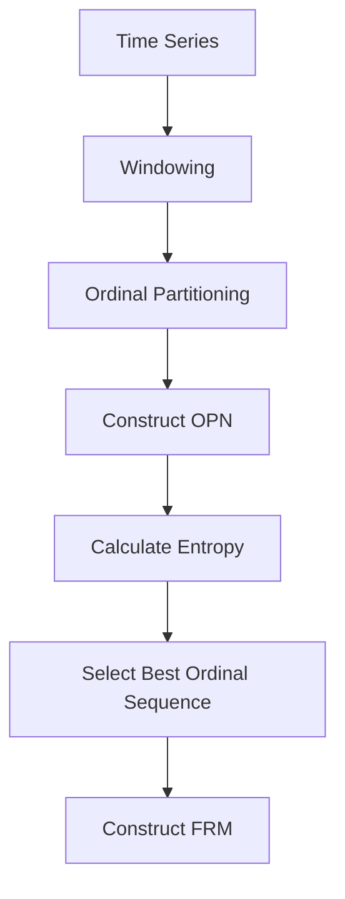

- **First Return Map (FRM)**: A discrete map connecting points of a dynamical system's orbit as it first returns to a Poincaré section. Essential for understanding chaotic dynamics.

- **Poincaré Section**: An n-1 dimensional surface transverse to the flow of a dynamical system, where orbits intersect to create the FRM.

- **Ordinal Partition Networks (OPN)**: A method to generate a network representation of a time series by partitioning it into ordinal sequences, capturing the relative order of points.

- **Ordinal Partitioning**: Two methods:
  - **Amplitude Ranking**: Ranks points based on their amplitude.
  - **Chronological Index Ranking**: Ranks points based on their time index.

- **Entropy-based Measures**: Used to evaluate and select the best ordinal sequences for constructing effective FRMs.

- **Algorithm Steps**:
  1. Define a window of length \( L \) and slide it over the time series.
  2. For each window, create an ordinal partition \( o(i) = (\pi_1, \pi_2, ..., \pi_m) \).
  3. Construct a weighted directed graph where nodes represent ordinal states and edges represent transitions.

- **Parameters for OPN**:
  - **Window Length \( L \)**: Determines the range of time series points analyzed.
  - **Number of Points \( m \)**: Points compared within each window.
  - **Overlap \( w \)**: Number of non-overlapping points between windows.

- **Takens' Delay Embedding Theorem**: A method for reconstructing phase space from time series, relevant for determining appropriate window lengths for OPN.

- **Noise Resistance**: The ordinal-based FRM approach is robust against noise, making it suitable for real-world data.

- **Applications**: Successfully applied to well-known chaotic systems like Lorenz, Rössler, and Mackey-Glass, demonstrating its versatility across different dynamical behaviors.

- **Comparison with Traditional Methods**: Unlike traditional embedding techniques, the ordinal-based approach does not require full access to the attractor or complex numerical models, simplifying the analysis of chaotic dynamics.

- **Visual Representation**: 

- **Key Findings**: The method provides a straightforward and computationally efficient way to reconstruct first return maps, enhancing the understanding of chaotic dynamics from scalar time series data.