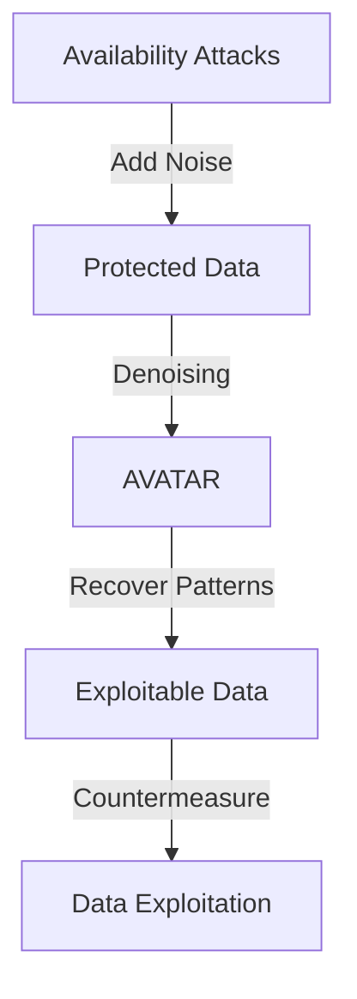

- **Title**: The Devil's Advocate: Shattering the Illusion of Unexploitable Data using Diffusion Models
- **Key Concept**: Availability attacks aim to protect personal data by adding imperceptible noise, claiming to make data "unexploitable."
- **Main Argument**: The paper argues that the notion of unexploitable data is an illusion, as diffusion models can effectively counteract data-protecting perturbations.
- **Proposed Method**: AVATAR (dAta aVailAbiliTy Attacks defuseR) leverages diffusion models to denoise data and recover original patterns.
- **Theoretical Insight**: The amount of denoising required is directly related to the magnitude of the data-protecting perturbations' norm.
- **Performance**: AVATAR outperforms adversarial training against various availability attacks across multiple datasets and architectures.
- **Denoising Process**: 
  - **Forward Process**: Adds Gaussian noise to images.
  - **Reverse Process**: Denoises the noisy images to recover the original data.
- **Mathematical Notation**:
  - Dataset: \( D = \{(x^{(i)}, y^{(i)})\}_{i=1}^n \)
  - Classifier: \( f_\theta: \mathbb{R}^d \to \mathbb{R}^K \)
  - Loss Function: 
    \[
    \text{arg min}_\theta E_{(x,y) \in D} [\ell(f_\theta(x), y)]
    \]
- **Key Findings**:
  - Unexploitable data cannot be guaranteed due to the potential for countermeasures.
  - Pre-trained density estimators can exploit protected data.
- **Related Work**: Discusses previous methods of data poisoning, backdoor attacks, and the limitations of existing availability attacks.
- **Implications**: Calls for further research into effective personal data protection methods beyond current availability attacks.

