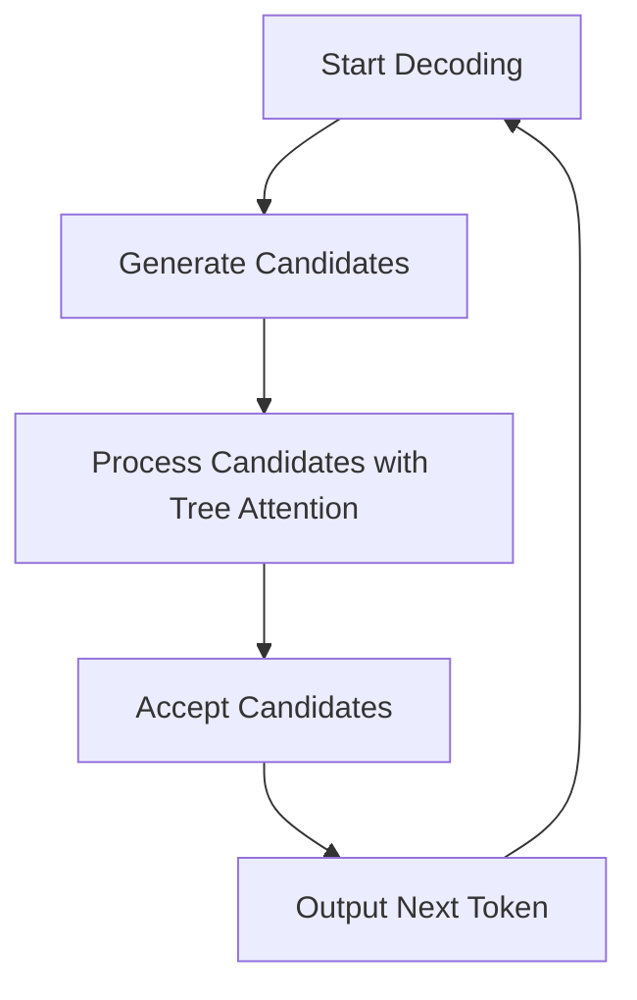

- **MEDUSA Overview**: A framework for accelerating LLM inference by adding multiple decoding heads to predict several tokens in parallel, addressing the bottleneck of sequential computation in autoregressive decoding.

- **Key Components**:
  - **MEDUSA Heads**: Additional decoding heads appended to the last hidden states of the original model, allowing concurrent prediction of multiple tokens.
    - Prediction formula: 
      \[
      p^{(k)}_t = \text{softmax}(W^{(k)}_2 \cdot \text{SiLU}(W^{(k)}_1 \cdot h_t) + h_t)
      \]
      where \(W^{(k)}_2 \in \mathbb{R}^{d \times V}\), \(W^{(k)}_1 \in \mathbb{R}^{d \times d}\), \(d\) is the output dimension, and \(V\) is the vocabulary size.

  - **Tree Attention**: A mechanism to process multiple candidate continuations concurrently, allowing only tokens from the same continuation to be considered as historical data.
    - Attention mask ensures that each token only attends to its predecessors.

- **Decoding Steps**:
  1. **Generating Candidates**: Using MEDUSA heads to predict multiple tokens.
  2. **Processing Candidates**: Utilizing tree attention to handle multiple candidates efficiently.
  3. **Accepting Candidates**: Employing either rejection sampling or a typical acceptance scheme to select the best candidates.

- **Fine-Tuning Procedures**:
  - **MEDUSA-1**: Fine-tunes MEDUSA heads on a frozen backbone model for lossless inference acceleration.
  - **MEDUSA-2**: Jointly fine-tunes MEDUSA heads and the backbone model for improved prediction accuracy and speedup, requiring a special training recipe.

- **Extensions**:
  - **Self-Distillation**: For scenarios with no training data, generating a training dataset for MEDUSA heads.
  - **Typical Acceptance Scheme**: Boosts acceptance rates while maintaining generation quality, using temperature as a threshold.

- **Performance Evaluation**: MEDUSA achieves a speedup of 2.3 to 2.8 times across various models (e.g., Vicuna-7B, 13B, 33B) without compromising generation quality.

- **Computational Efficiency**: By leveraging parallel processing and tree-based attention, MEDUSA enhances the arithmetic intensity of the decoding process, reducing the number of decoding steps required.

- **Diagrammatic Representation** (if needed):

- **Conclusion**: MEDUSA provides a user-friendly, efficient solution for LLM inference acceleration, integrating seamlessly into existing systems without the need for a separate draft model.