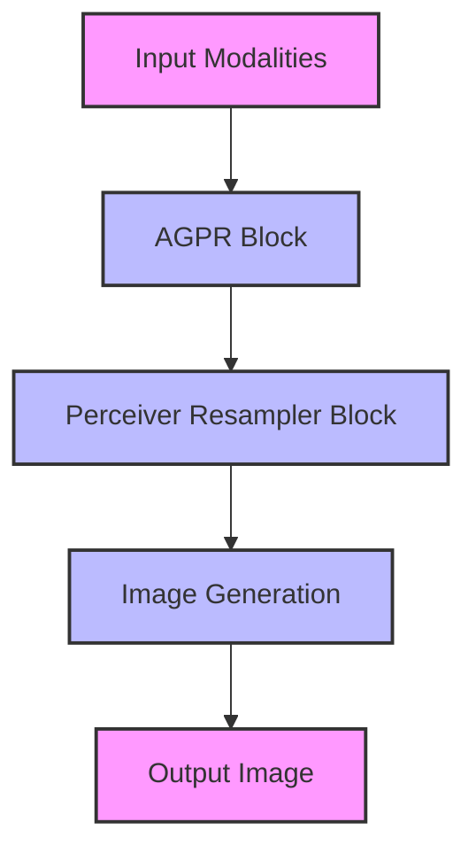

- **Model Overview**: EMMA is a multi-modal image generation model built on the ELLA text-to-image diffusion model, designed to effectively integrate multiple modalities (text and images) without requiring additional training.

- **Key Innovation**: Introduces the Assemblable Gated Perceiver Resampler (AGPR) which utilizes cross-attention to merge information from various modalities into the image generation process, maintaining strong control over text conditions.

- **Parameter Freezing**: All parameters of the original ELLA model are frozen, allowing EMMA to adapt to multi-modal prompts by only adjusting additional layers, enhancing flexibility and efficiency.

- **Multi-modal Feature Connector**: The AGPR blocks are interleaved with Perceiver Resampler blocks to facilitate effective integration of multi-modal information during the image generation process.

- **Compatibility**: EMMA is designed to be a plug-and-play module compatible with existing diffusion models, particularly the Stable Diffusion framework, allowing for diverse applications without the need for retraining.

- **Performance**: Extensive experiments demonstrate EMMA's ability to generate high-fidelity images while preserving both textual and visual details, showcasing robustness against various control signals.

- **Applications**: EMMA can be used for personalized image generation, portrait generation, cartoon generation, and subject-driven video generation, highlighting its versatility across different domains.

- **Training Efficiency**: The modular assembly of models conditioned on different modalities allows for streamlined processes, conserving resources and accelerating adaptability to new tasks.

- **Attention Mechanism**: The model employs a special attention mechanism to balance the influence of different modalities during the image generation process, addressing the challenge of bias towards easier conditions.

- **Diagrammatic Representation**: 

- **Research Contributions**:
  1. **Integration Mechanism**: Novel approach for merging multi-modal prompts into image generation.
  2. **Modular Training**: Efficient model training without retraining for new conditions.
  3. **Universal Compatibility**: Works seamlessly with various existing models.
  4. **Robust Performance**: Maintains high fidelity and detail in generated images.