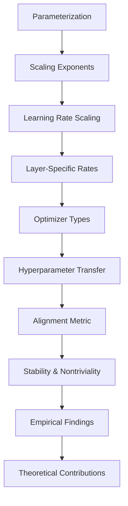

- **Key Concepts:**
  - **Parameterization:** A method for scaling important quantities (initialization scale, parameter multipliers, learning rate) with respect to scaling dimensions (model width, depth, context length, batch size, training horizon).
  - **Scaling Exponents:** Critical for ensuring stable training dynamics as model size increases; improper selection can lead to scaling mismatches.

- **Learning Rate Scaling:**
  - **Global Learning Rate Limitation:** Constrains all layers to use the same exponent, leading to potential instability.
  - **Layer-Specific Learning Rates:** 
    - Hidden layer: \( O(1/\sqrt{n}) \)
    - Readout layer: \( O(1/n) \)

- **Parameterization Types:**
  - **Standard Parameterization**
  - **Neural Tangent Kernel (NTK) Parameterization**
  - **Maximal Update Parameterization (muP)**
  - **Mean-Field Parameterization (MFP)**

- **Optimizer Types:**
  - **Stochastic Gradient Descent (SGD):** Update scale matches learning rate times gradient scale.
  - **Adam:** Update scale matches learning rate, independent of gradient scale.
  - **Adafactor:** Update scale matches learning rate times parameter scale.

- **Epsilon Parameter in Adam:**
  - Must be scaled correctly to avoid gradient underflow.
  - **Adam-atan2:** A new version of Adam that eliminates the epsilon hyperparameter entirely.

- **Hyperparameter Transfer:**
  - All parameterizations can achieve hyperparameter transfer, not just muP.
  - Constant multiplicative factors can be tuned at small scales and reused for larger models.

- **Alignment Metric:**
  - Measures correlation between parameters and activations during training.
  - Significant alignment leads to improved scaling behavior and performance.

- **Stability and Nontriviality:**
  - Stability: Activations remain at constant scale; logits do not exceed constant scale.
  - Nontriviality: Change in logits after initialization is at least constant scale.

- **Empirical Findings:**
  - Best learning rate prescriptions often excluded by prior alignment assumptions.
  - Per-layer learning rate prescriptions outperform global learning rates across various settings.

- **Theoretical Contributions:**
  - Generalized parameterization theory quantifying distinct alignment terms.
  - Recovery of prior work under specific alignment assumptions.

- **Diagrammatic Note (if needed):**
