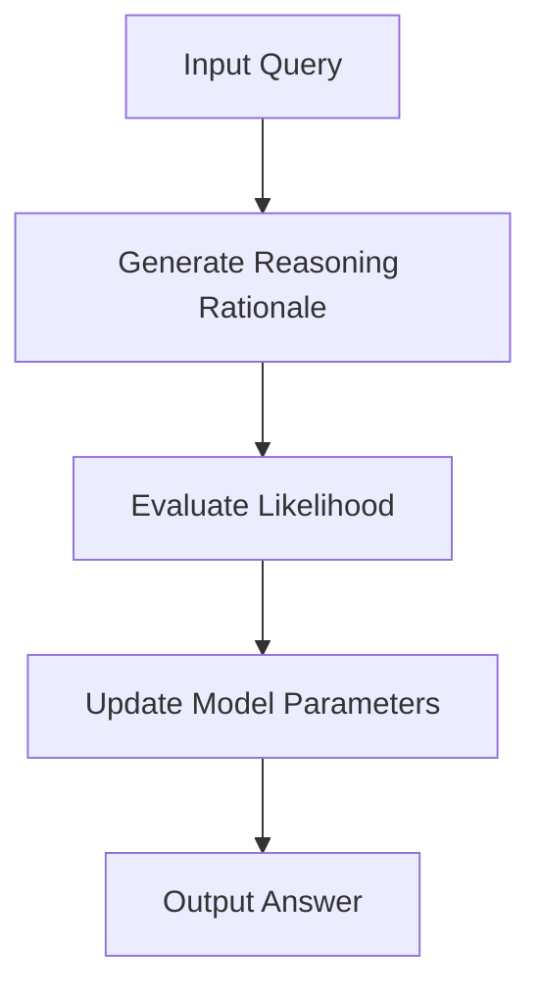

- **LaTent Reasoning Optimization (LaTRO)**: A framework that optimizes reasoning in LLMs by sampling from a latent distribution and using variational approaches.
  
- **Key Contributions of LaTRO**:
  - Theoretical formulation connecting LLM reasoning optimization to latent variable models.
  - Self-rewarding mechanism leveraging the model's own probability estimates.
  - Significant performance improvements on reasoning tasks (e.g., GSM8K) across various model architectures.

- **Performance Metrics**:
  - LaTRO improves zero-shot accuracy by an average of 12.5% over base models and 9.6% over supervised fine-tuning on GSM8K.

- **Reasoning Techniques**:
  - Chain-of-Thought (CoT): Decomposes tasks into smaller reasoning steps.
  - Self-Consistency Chain-of-Thought (CoT-SC): Uses majority voting over multiple reasoning paths to enhance accuracy.

- **Self-Rewarding Mechanism**:
  - LaTRO allows LLMs to evaluate the quality of their reasoning paths without external feedback, enabling self-improvement.

- **Mathematical Formulation**:
  - Objective for optimizing reasoning rationale:
    \[
    \max_{\theta} E_{(x, y) \sim D_{Gold}} [\log \pi_{\theta}(y | x)]
    \]
  - Introduces reasoning rationale \( z \):
    \[
    \log \pi_{\theta}(y | x) = \log \pi_{\theta}(y | x \oplus z) \cdot \pi_0(z | x) dz
    \]

- **Algorithm Overview**:
  - LaTRO iteratively samples reasoning rationales, evaluates their likelihood of producing correct answers, and updates model parameters to favor high-quality rationales.

- **Experimental Validation**:
  - LaTRO validated on GSM8K and ARC-Challenge datasets, demonstrating enhanced reasoning capabilities in LLMs.

- **Diagrammatic Representation** (if needed):

- **Limitations of Traditional Approaches**:
  - Scarcity of high-quality reasoning data limits supervised fine-tuning.
  - Deterministic reasoning paths may lead to over-confidence and performance degradation.

- **Future Directions**:
  - Explore further optimization techniques to enhance reasoning capabilities in LLMs without relying on external feedback or task-specific examples.