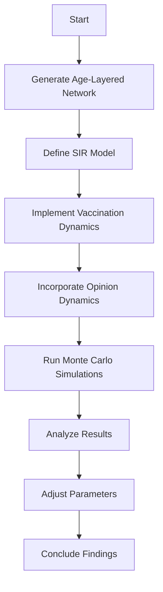

- **Key Concepts:**
  - **Complex Contagion:** Human behavior dynamics, such as vaccine uptake, depend on multiple social contacts rather than a single infected neighbor.
  - **SIR Model:** Standard model for epidemic spread, defined by:
    - \( S + I \xrightarrow{\beta} I + I \)
    - \( I \xrightarrow{\mu} R \)
    - Basic reproduction number \( R_0 = 1.5 \), recovery rate \( \mu = 0.2 \).
  
- **Vaccination Dynamics:**
  - Vaccination modeled as a Poisson process:
    - \( S \xrightarrow{\alpha} V \)
    - Vaccination rate \( \alpha \) varies from 0.001 to 0.05.
  
- **Opinion Dynamics:**
  - Attitudes towards vaccination are binary: hesitant (H) or active (A).
  - Transition defined by:
    - \( H \xrightarrow{} A \)
  - Threshold-based updating rule from Watts-Granovetter model:
    - \( o_i(t + 1) = 1 \) if the number of vaccinated neighbors exceeds a threshold.

- **Simulation Framework:**
  - Discrete-time Monte Carlo simulations on an age-layered contact network.
  - Main observables:
    - Active agents \( N_A(\infty) \)
    - Prevalence \( R(\infty) \)
    - Vaccination coverage \( V(\infty) \)
  - Normalized quantities:
    - \( r(\infty) = R(\infty)/N \)
    - \( v(\infty) = V(\infty)/N \)
    - \( n_A(\infty) = N_A(\infty)/N \)
    - Change in vaccine support: 
      - \( \Delta n_A(\infty) \equiv n_A(\infty) - n_A(0) / (1 - n_A(0)) \)

- **Parameter Exploration:**
  - Examined effects of varying activation thresholds \( \theta \) and initial active individuals \( n_A(0) \).
  - Different vaccination scenarios analyzed to observe system behavior under low to high vaccination efforts.

- **Findings:**
  - Low vaccination rates (e.g., \( \alpha = 0.001 \)) lead to minimal changes in vaccine support and high disease prevalence.
  - Increasing vaccination rates enhances vaccine uptake and reduces disease prevalence, particularly when initial support is high.

- **Modeling Approach:**
  - Age-layered contact networks generated from data-driven synthetic populations.
  - Vaccination thresholds informed by real-world surveys on vaccine hesitancy.

- **Visual Summary:**

- **Implications:**
  - Understanding the interplay between epidemic dynamics and social behavior is crucial for effective public health interventions, particularly in vaccination campaigns.