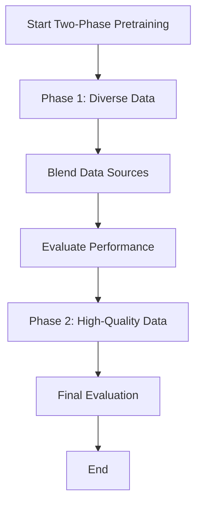

- **Two-Phase Pretraining Concept**: Formalizes a two-phase approach to enhance LLM accuracy, focusing on data quality and epoch distribution.
  
- **Phase 1 (P1)**: Emphasizes diverse, high-quality web crawl data mixed with medium and low-quality data.
  
- **Phase 2 (P2)**: Concentrates on high-quality datasets (math, code, wiki) with limited medium-quality data.
  
- **Data Blending Strategy**: 
  - Use downsampled data (1T tokens) to prototype blends.
  - Scale to larger datasets (15T tokens) while maintaining quality and epoch considerations.
  
- **Performance Improvement**: 
  - Two-phase approach outperforms random data ordering by 3.4% and natural distribution by 17% on average accuracies.
  - Quality and epoch-based blends outperform natural distribution blends by 13.2%.
  
- **Downsampling Factor**: \( f = \frac{1}{15} \) for token allocation across datasets, ensuring effective scaling from 1T to 15T tokens.
  
- **Evaluation Metrics**: 
  - 5-shot accuracy for MMLU, 0-shot accuracy for reasoning tasks (CommonsenseQA, ARC-Easy, etc.), and 8-shot CoT accuracy for GSM8K.
  
- **Blend Evaluation**: 
  - Five blends evaluated in P1 and P2, with performance assessed through validation loss and downstream task accuracy.
  - Best blends identified: P1-Blend4 and P2-Blend1.
  
- **Model Specifications**: 
  - Utilizes Megatron model (8B parameters) trained on 1T tokens, with scalability tests on 15T tokens and 25B model size.
  
- **Key Findings**: 
  - Effective data blending and ordering strategies are crucial for LLM pretraining.
  - Quality-based and epoch-based analyses lead to better model performance.
  
- **Actionable Steps for Practitioners**: 
  - Follow the proposed two-phase approach for data selection and blending to maximize LLM performance.
  
- **Diagrammatic Representation** (if needed):
