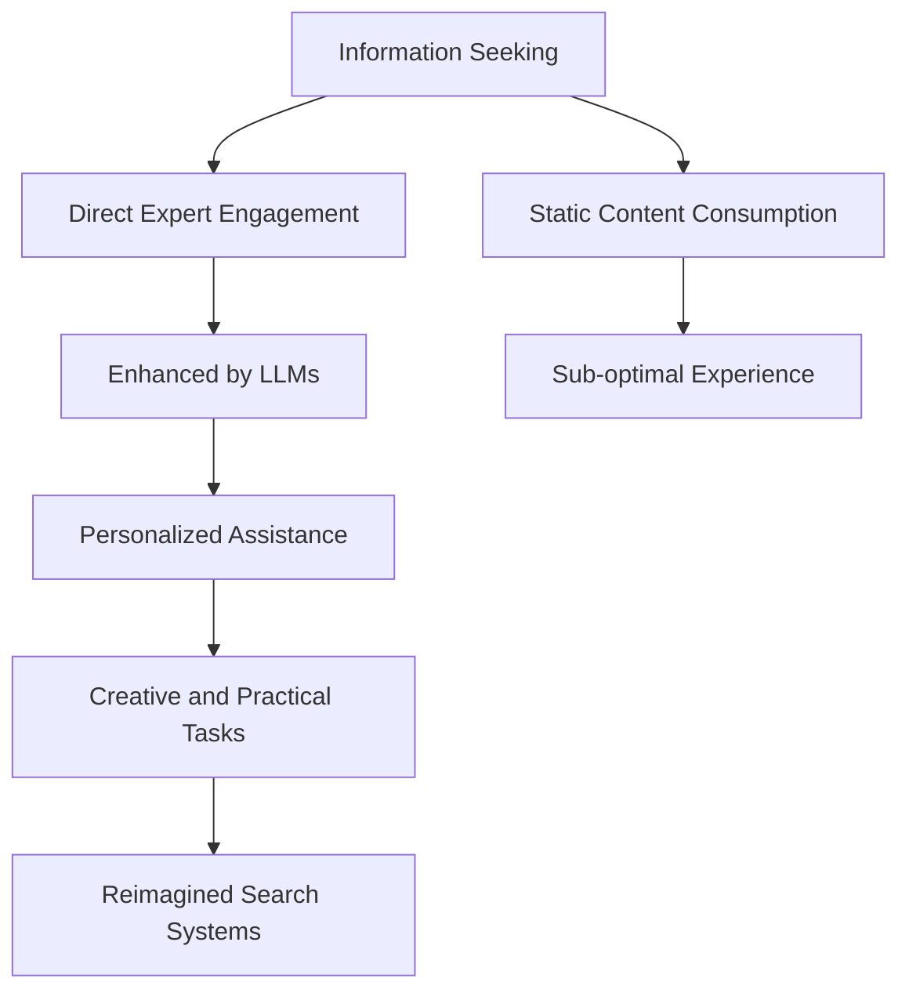

- **Core Hypothesis**: The future of search should return to direct expert engagement, enhanced by large language models (LLMs) to overcome scalability challenges.
  
- **Historical Context**: Preliterate societies relied on direct conversations with experts for information seeking; writing emerged ~5000 years ago to materialize and replicate knowledge.

- **Scalability Challenges**:
  - **Bandwidth Limitation**: Experts can only engage in a limited number of conversations daily due to other responsibilities.
  - **Finding Experts**: As populations grow, identifying and accessing relevant experts becomes increasingly difficult (related to Dunbar's number).

- **Invention of Writing**: 
  - Enabled the materialization of knowledge, solving the bandwidth problem by allowing knowledge to be preserved and disseminated across time and space.
  - Facilitated the replication of knowledge, reducing costs over time (e.g., printing press, web).

- **Sub-optimal User Experience**: Static content (books, articles) limits interaction; users cannot engage in follow-up questions or clarifications.

- **Emergence of LLMs**: 
  - LLMs can serve as digital avatars of experts, allowing for interactive engagement rather than passive consumption of materialized knowledge.
  - Economic factors favor the proliferation of LLMs, with decreasing computation costs for inference.

- **Future of Search**:
  - Transition from searching for static content to interacting with LLMs that can provide personalized assistance and fulfill complex information needs.
  - Reconceiving search as finding the right assistant rather than merely seeking information.

- **Potential Applications of LLMs**:
  - Beyond answering questions, LLMs can assist in creative tasks (e.g., composing poetry) and practical problem-solving (e.g., DIY repairs).

- **Need for Reimagined Search Systems**: Current search techniques are inadequate for a future dominated by LLM interactions; new frameworks are necessary to connect users with relevant LLMs effectively.

- **Key References**:
  - Taylor (1962): Emphasizes the importance of direct communication in information seeking.
  - Dunbar (1962): Introduces the concept of cognitive limits on social relationships.
  - Jevons (1866): Discusses the relationship between resource availability and demand for LLMs.

- **Diagrammatic Note** (if needed):
