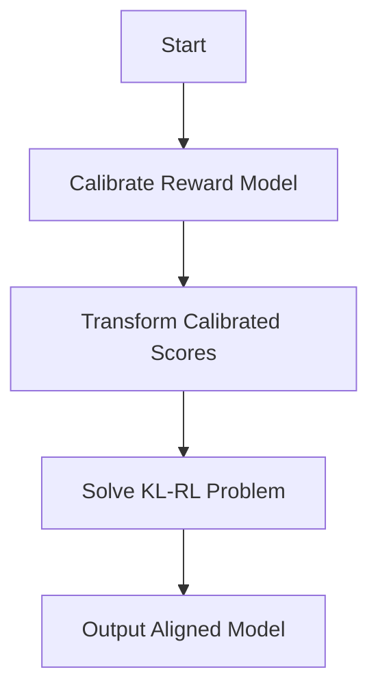

- **Objective of InfAlign**: Optimize inference-time win rate of aligned model against reference model using KL-regularized RL framework.
  
- **Key Definitions**:
  - **KL-regularized RL Problem**: 
    \[
    \pi^*_{r,\beta}(\cdot | x) = \arg \max_\pi E_{y \sim \pi(\cdot | x)} \{r(x, y)\} - \beta D_{KL}(\pi(\cdot | x) \| \pi_{ref}(\cdot | x))
    \]
  - **Inference-time Win Rate**:
    \[
    W^T_r(\pi_1 \succ \pi_2 | x) = E_{y \sim T(\pi_1)(\cdot | x), z \sim T(\pi_2)(\cdot | x)} \{w_r(y, z | x)\}
    \]

- **Framework Overview**: InfAlign modifies the alignment objective to account for inference-time decoding methods, ensuring that the model is optimized for practical use cases.

- **CTRL Algorithm**: 
  1. **Calibrate** the reward model scores based on responses from the reference model.
  2. **Transform** the calibrated scores according to the inference-time procedure.
  3. **Solve** the KL-RL problem using existing optimization algorithms (e.g., PPO).

- **Inference-time Procedures**:
  - **Best-of-N (BoN) Sampling**: Select the response with the highest reward from N samples.
  - **Best-of-N Jailbreaking (WoN)**: Select the response with the lowest reward to evaluate model robustness against adversarial inputs.

- **Theoretical Contributions**:
  - **Lemma 1**: For any inference-time procedure \( T \), there exists a reward function \( R_{r,\pi_{ref},T} \) such that solving the KL-RL problem with \( R \) leads to an optimal solution for maximizing inference-time win rate.
  
- **Key Results**:
  - CTRL outperforms state-of-the-art methods by 8-12% for BoN and 4-9% for WoN on inference-time win rates.
  
- **Reward Transformation**: 
  - The optimal reward transformation is shown to be independent of the base policy and reward model for BoN and WoN, allowing for offline computation.

- **Empirical Validation**: CTRL achieves competitive performance on the Anthropic helpfulness and harmlessness datasets, demonstrating the effectiveness of the proposed framework.

- **Equations for Optimal Policy**:
  - The optimal policy \( \pi^* \) satisfies:
    \[
    \pi^*(y|x) \propto \pi_{ref}(y | x) e^{\frac{1}{\beta} R(x,y)}
    \]
  - The transformed reward \( R(x, y) \) is derived from the win rate optimization:
    \[
    R(x, y) = \frac{\partial}{\partial \pi(y | x)} W^T_r(\pi \succ \pi_{ref} | x)
    \]

- **Diagrammatic Representation** (if needed):

- **Conclusion**: InfAlign provides a robust framework for aligning language models with practical inference-time procedures, enhancing their performance in real-world applications.